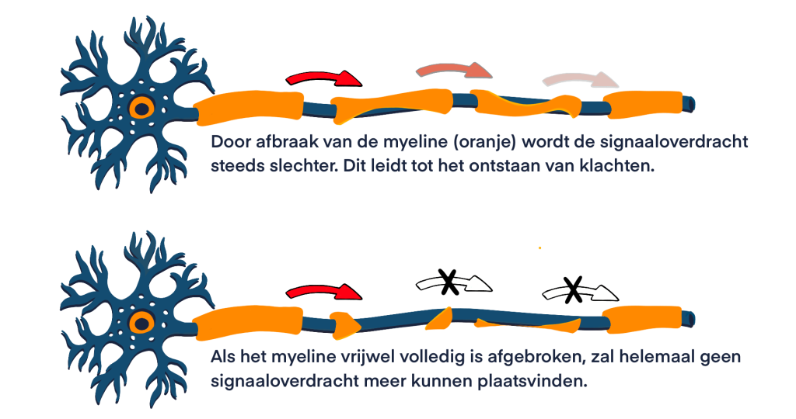

# Wat is MS?

MS is een niet-erfelijke **auto-immuunziekte** die het [centrale zenuwstelsel](gezonde_zenuwstelsel.md) (CZS) aantast. 

MS wordt gekenmerkt door *chronische ontstekingen* in het centraal zenuwstelsel (CZS), wat leidt tot de vorming van `demyelinated plaques`. Naast de **vernietiging van delen van de myelineschede** ontstaat er ook `gliaal littekenweefsel`, bij de ontstekingsreactie komen vooral veel lymfocyten en mononucleaire fagocyten voor (Brück et al., 1996). De afbraak van myeline zorgt ervoor dat de signaaloverdracht minder snel/goed plaats kan vinden, wat leidt tot klachten. Daarnaast ontstaat er ook schade aan de [bloed-hersen barriere](#bloed-hersen-barriere).

Er zijn twee processen die een grote rol spelen bij de pathologie van MS. Dit zijn: 

- **Ontstekingen** die zich beperken tot specifieke plekken in het CZS, deze leiden tot macroscopische **plaques** en scade aan de bloed-hersen barriere 
- **Neurodegeneratie** wat leidt tot microscopische schade aan verschillende delen van het CZS, bijvoorbeeld aan axonen, neuronen en synapsen

Visualisatie afbraak myelineschede (MS Research, 2022).

## Kenmerken plaque

Kenmerken van een ‘plaque’ zijn o.a. (Tafti et al., 2024):

- Grootschalig binnendringen van macrofagen in weefsel/gebied
- Afgebroken myeline dat wordt teruggevonden in macrofagen
- Ophoping van ontstekingscellen rond de bloedvaten
- Gezwollen astrocyten die actief aan het delen zijn
- Aanwezigheid van lymfocyten, met name CD8-positieve cytotoxische T-cellen

## Bloed-hersen barriere

De **bloed-hersen barriere** (ook wel ‘blood-brain barrier/BBB’) is een selectief, semi-permeabel membraan tussen de bloedvaten en de hersenen. De functie van de barriere is het beschermen van de hersenen tegen gevaarlijke stoffen, door de stoffen in het bloed te filteren en alleen onschadelijke stoffen zoals voedingsstoffen door de membraan heen te laten gaan. Bij MS is er sprake van afbraak van de BBB, waardoor schadelijke stoffen makkelijker doorgelaten worden naar de hersenen (Dotiwala et al., 2023).

___________________________________________________________________
## Hoe vaak komt MS voor?

In Nederland leven minstens **25.000** mensen met MS, wereldwijd wordt dit aantal geschat op ongeveer **2,8 miljoen**. Hoe vaak MS voorkomt, verschilt per land. In Nederland heeft **1 op de 700** mensen MS (MS Research, 2024). 

## Bij wie komt MS het meeste voor?

De meeste mensen met MS krijgen de diagnose op een leeftijd **tussen de 20 en de 40 jaar**. Maar MS kan ook bij kinderen voorkomen of juist op een oudere leeftijd (MS Research, 2024). 
___________________________________________________________________
## Hoe ontstaat MS?

Hoe MS precies ontstaat en wat de oorzaken zijn, is **nog niet bekend**. Wel is het duidelijk dat er meerdere factoren zijn die bijdragen aan het ontstaan van MS (MS Research, 2024). 

## Risicofactoren

Volgens MS Research (2023, 2024) zijn er veel verschillende risicofactoren die een rol zouden kunnen spelen bij het ontstaan van MS.

- **Blootstelling aan zonlicht en daarmee ook de hoeveelheid vitamine D in het lichaam**
- **Geografische locatie**: MS komt vaker voor in landen die verder van de evenaren liggen
- **Verschillen in geslacht**: MS komt twee keer zo vaak voor bij vrouwen
- **Blootstelling aan rook**
- **Obesitas gedurende de kinder- en/of pubertijd**
- **Het Epstein-Barr virus (EBV)**: veelvoorkomend virus dat de B-cellen infecteert

### Epstein-Barr virus
Het `Epstein-Barr virus` is een van de meestvoorkomende virussen en komt voor in **95%** van de wereldbevolking. Het wordt overgedragen via lichaamsvloeistoffen en geeft meestal geen ziekteverschijnselen. Soms geeft het wel ziekteverschijnselen en kan het bijvoorbeeld optreden in de vorm van de `ziekte van Pfeiffer`. De link met MS is dat **99%** van de MS patiënten EBV bij zich dragen, dit is nóg hoger dan hoe vaak het onder de totale bevolking voorkomt. Echter is het dragen van EBV alleen geen garantie op het ontstaan van MS, omdat het gewoonlijk ook al een veelvoorkomend virus is, wel is het zo dat EBV de kans groter maakt op het ontstaan van MS (MS Research, 2023).
___________________________________________________________________

# Bronnen

- MS Research. (2023, december 4). Epstein-Barr virus en multiple sclerose (MS) - MS Research. [https://msresearch.nl/over-ms-ziekte/oorzaak/epstein-barr-virus-en-multiple-sclerose-ms/](https://msresearch.nl/over-ms-ziekte/oorzaak/epstein-barr-virus-en-multiple-sclerose-ms/)
- MS Research. (2024, februari 6). Wie krijgen multiple sclerose (MS)? - Stichting MS Research. [https://msresearch.nl/over-ms-ziekte/patient/](https://msresearch.nl/over-ms-ziekte/patient/)
- MS Research. (2022, 15 juli). Myeline schade en herstel - MS Research. https://msresearch.nl/over-ms-ziekte/oorzaak/myeline-schade-en-herstel/