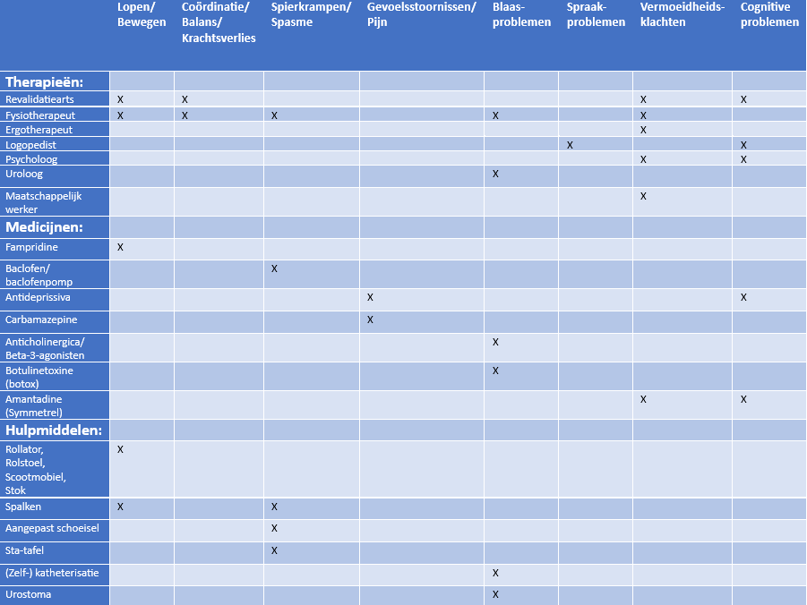

# Behandeling MS 

MS is (nog) niet te genezen, maar er zijn een aantal medicijnen die MS kunnen onderdrukken. Je noemt deze medicijnen DMT’s. Dit staat voor ‘**Disease-Modifying therapies**’. Je kunt DMT’s onderverdelen in *eerstelijns* en *tweedelijns*. Waarbij eerstelijns minder agressief zijn en dus een minder risico met zich meebrengen. Een voorbeeld van eerstelijns DMT is `interferon-bèta`. En een voorbeeld van een tweedelijns DMT is `ocrelizumab` (richt zich op de B-cellen).  

Als de eerstelijns DMT onvoldoende werkt, wordt er een tweedelijns DMT geprobeerd. Als ook dit niet voldoende werkt, is de patiënt in de progressieve fase. In dit geval kunnen multidisciplinaire behandelingen de kwaliteit van het leven nog wel verbeteren. 

Helaas zijn er ook **bijwerkingen** van MS-medicijnen. Deze bijwerkingen verschillen van huiduitslag, hoofdpijn of vermoeidheid tot hartklachten of leverfalen. Er wordt dan ook door een neuroloog met de patiënt gekeken naar wat de beste optie is voor de patiënt. De MS-medicijnen remmen ook het afweersysteem, wat de kans op infecties vergroot en sommige vormen van kanker. 
___________________________________________________________________

## Multidisciplinaire behandeling 

Er zijn ook behandelingen gericht op de klachten die een patiënt ervaart. Bij een multidisciplinaire behandeling worden deze behandeld. Er zijn verschillende zorgverleners die helpen bij de behandeling. Dit is nodig omdat er veel verschillende soorten klachten zijn. Iemand met MS krijgt hulp van een neuroloog, huisarts en verpleegkundige. Daarnaast hangt de hulpverlening af van de klachten die de patient ervaart. Mogelijke zorgverleners bij MS zijn (MS Research, 2024): 

- Revalidatiearts 
- Fysiotherapeut 
- Ergotherapeut 
- Logopedist 
- Diëtist 
- (Neuro)psycholoog 
- Seksuoloog 
- Uroloog 
- Maatschappelijk werker 

Het middelpunt van de hulpverleners is de verpleegkundige. De verpleegkundige zorgt ervoor dat de patient geïnformeerd wordt over de aandoening en de opties in het behandelen hiervan. Tijdens de behandeling is de verpleegkundige ook het aanspreekpunt voor de patient. De patient kan vragen stellen aan de verpleegkundige en de verpleegkundige kan eventueel voor doorverwijzingen zorgen naar andere zorgverleners. 

In de onderstaande tabel zie je de behandelingsmogelijkheden (rijen) voor de mogelijke klachten (kolommen). De rijen zijn opgedeeld in therapieën, medicijnen en hulpmiddelen.

___________________________________________________________________

## Medicatie

Onderstaand is een overzicht te zien met medicijnen die worden gebruikt om symptomen/klachten van MS te behandelen (MS Research, 2024;MS Research, 2024a) .

### Fampridine 
Een medicijn dat kan helpen bij loopproblemen. Het blokkeert kaliumkanalen in zenuwen. Hierdoor lekt er minder "stroom" weg, blijft het signaal sterker en kan het beter worden doorgegeven, zelfs bij beschadigde zenuwen. Het medicijn werkt bij ongeveer een derde van de patiënten. Fampridine kan echter ook bijwerkingen hebben. De meest voorkomende bijwerking is een urineweginfectie. Andere mogelijke bijwerkingen zijn tintelingen, maagdarmklachten, benauwdheid of duizeligheid.

### Baclofen 
Een medicijn dat wordt gebruikt om spierspanning en spasmen te behandelen. Het zorgt ervoor dat de spieren ontspannen. Als een patiënt last heeft van ernstige spasticiteit, kan operatief een baclofenpomp worden geplaatst. Deze pomp geeft het medicijn rechtstreeks af in de vloeistof rond het ruggenmerg, in plaats van via de bloedbaan (zoals zonder de pomp). Hierdoor is een veel lagere dosis nodig, wat het risico op bijwerkingen vermindert.

### Antidepressiva 
Medicijnen die met lage dosering kunnen helpen tegen pijnlijke gevoelsstoornissen. Vaak helpen gewone pijnstillers hierbij namelijk niet. Verder kan het helpen tegen somberheid (bijvoorbeeld bij de cognitieve problemen).

### Carbamazepine 
Een medicijn dat vaak wordt gebruikt om zenuwpijn te behandelen. Het werkt door de zenuwen in de hersenen en het ruggenmerg te stabiliseren, waardoor de pijnsignalen minder sterk doorkomen. Dit helpt bij het verminderen van scherpe, plotselinge pijn die veroorzaakt wordt door beschadigde zenuwen. Carbamazepine kan bijwerkingen veroorzaken, zoals duizeligheid, slaperigheid, misselijkheid en in sommige gevallen huiduitslag of leverproblemen.

### Anticholinergica (bijvoorbeeld oxybutynine, tolterodine, solifenacine)
Medicijnen die helpen de blaasspier te ontspannen en verminderen de aandrang om te plassen. Ze voorkomen ongewilde samentrekkingen van de blaasspier, waardoor plotselinge aandrang en frequent urineren worden verminderd.

### Beta-3-agonisten (bijvoorbeeld mirabegron)
Dit medicijn stimuleert receptoren in de blaasspier, waardoor de spier ontspant en de blaas beter kan worden gevuld. Het helpt vooral bij het verminderen van de aandrang om te plassen.

### Botulinetoxine (beter bekend als 'botox')
Botox wordt bij de behandeling van een overactieve blaas rechtstreeks in de blaasspier geïnjecteerd en verlamt de spier tijdelijk, waardoor de overactieve blaasspier zijn spasmen vermindert en de blaas beter kan worden gecontroleerd. De werking houdt meestal enkele maanden aan.

### Amantadine (Symmetrel) 
Een medicijn dat kan helpen tegen vermoeidheid. Echter werkt dit medicijn niet altijd bij vermoeidheid bij MS. Een neuroloog adviseert of dit medicijn een optie is bij de patiënt.
___________________________________________________________________

## Toelichting hulpmiddelen

- **Zelfkatheterisatie** houdt in dat je zelf een buisje (katheter) in je plasbuis doet om je blaas leeg te maken als je niet goed kunt plassen.
- **Urostoma** houdt in dat er een zakje aan je buik vastzit, waar je plas in komt als je blaas niet goed werkt. Je kan dit zakje dan legen en je hoeft dan niet meer naar de wc te gaan. 
___________________________________________________________________

## Behandeling bij schubs
Een ['schub'](vormen.md/#relapses) is een plotselinge verergering van klachten. De behandeling die hierbij gegeven wordt is `methylprednisolon`. Dit medicijn remt de verergerde klachten. Omdat het medicijn niet langdurig wordt gebruikt zijn de bijwerkingen niet extreem. Vaak voelen mensen zich opgejaagd en vermoeid (MS Research, 2020a).
___________________________________________________________________

## Stamcel therapie
Omdat het afweersysteem verslechtert door de behandeling, kan in ernstige gevallen een stamceltherapie aangeraden worden. Dit zorgt ervoor dat het afweersysteem opnieuw wordt opgebouwd, doordat stamcellen worden gebruikt om nieuwe, gezonde cellen te maken die het immuunsysteem kunnen versterken en ondersteunen.
Deze therapie wordt vaak aangeraden bij mensen met `RRMS` tussen de 18 en 55 jaar (MS Research, 2023).
___________________________________________________________________

## Revalidatie
Nadat iemand MS heeft gehad kunnen er lichaamsfuncties minder goed of niet meer werken. Om hiermee te leren leven krijgt de patiënt hulp van een revalidatiearts. Deze arts maakt een persoonlijk behandelplan. Deze kan bestaan uit hulp van bijvoorbeeld een fysiotherapeut, ergotherapeut, logopedist, diëtist, psycholoog en/of maatschappelijk werker (MS Research, 2020). 

___________________________________________________________________
# Bronnen

- MS Research. (2020, 22 oktober). Revalidatie bij MS: doelen stellen – Stichting MS Research. [https://msresearch.nl/leven-met-ms/ms-behandeling/ms-revalidatie/](https://msresearch.nl/leven-met-ms/ms-behandeling/ms-revalidatie/)
- MS Research. (2020a, oktober 5). Behandeling van een MS-schub – Stichting MS Research. [https://msresearch.nl/leven-met-ms/ms-behandeling/behandeling-van-een-ms-schub/](https://msresearch.nl/leven-met-ms/ms-behandeling/behandeling-van-een-ms-schub/)
- MS Research. (2024, 27 augustus). Symptomen van MS behandelen – MS Research. [https://msresearch.nl/leven-met-ms/ms-behandeling/symptomen-van-ms-behandelen/](https://msresearch.nl/leven-met-ms/ms-behandeling/symptomen-van-ms-behandelen/)
- MS Research. (2024a, augustus 13). Medicatie bij MS: beschikbaarheid en werkzaamheid – MS Research. [https://msresearch.nl/leven-met-ms/ms-behandeling/medicatie/](https://msresearch.nl/leven-met-ms/ms-behandeling/medicatie/)
- MS Research. (2023, 19 december). Stamceltransplantatie bij MS: onderzoek en risico’s – MS Research. [https://msresearch.nl/leven-met-ms/ms-behandeling/stamceltherapie/](https://msresearch.nl/leven-met-ms/ms-behandeling/stamceltherapie/)