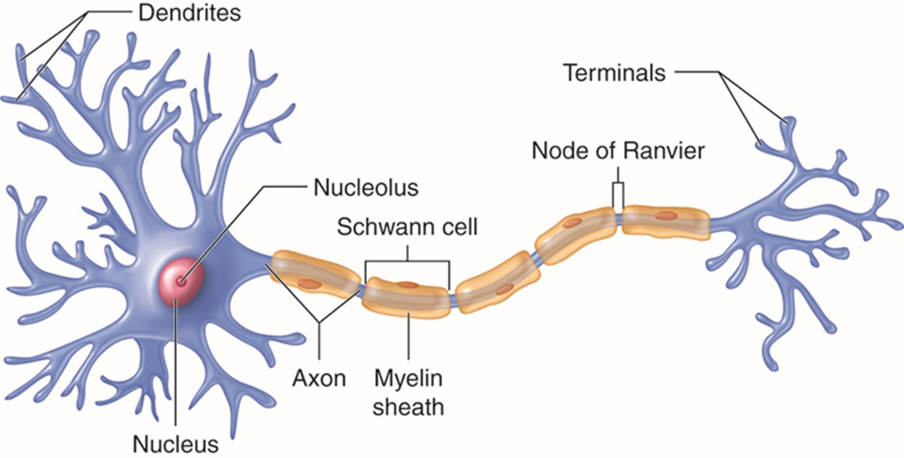

# Het gezonde zenuwstelsel

Voordat we uitgebreid gaan bespreken over de (dis)functionaliteit van het zenuwstelsel bij multiple sclerose (MS), is het belangrijk om te weten hoe het zenuwstelsel normaal functioneert. Het zenuwstelsel bestaat uit een twee delen:

- `Het centrale zenuwstelsel` (CZS), dit bestaat uit de hersenen en het ruggenmerg
- `Het perifeer zenuwstelsel` (PZS), dit bestaat uit de zenuwen die vertakken vanaf het ruggenmerg en zich uitspreiden over alle delen van het lichaam

Bij MS bevindt het probleem zich met name in het CZS, zo ontstaan er **ontstekingen** in de hersenen en/of het ruggenmerg. Om deze reden zullen wij ons focussen op het CZS en niet op het perifeer zenuwstelsel.
___________________________________________________________________

## Opbouw CZS

Het CZS is opgebouwd uit zenuwcellen (ook wel: **neuronen**). Een neuron is een lange, uitgestrekte cel. Met uitlopers aan beide kanten, om elektrische signalen te ontvangen (`dendrieten`) en te versturen (`axonen`) van en naar andere neuronen. De celkern van de neuron bevindt zich in het CZS en de axonen maken deel uit van het PZS en vervoeren zo informatie van alle delen buiten het CZS naar het CZS toe (NIH, 2018). De uiteinden van de dendrieten heten synapsen, via de synapsen gaat de communicatie tussen zenuwcellen (Nederlands Herseninstituut, 2022).

### Myelineschede

In sommige neuronen zit er een laag van myeline (`myelineschede`) om de axonen. Dit is een vettige stof dat er onder andere voor zorgt dat de elektrische signalen sneller door de axonen kunnen bewegen. Ook zorgt de myelineschede voor insulatie van het elektrische signaal en zorgt het ervoor dat de signaal niet wordt verstoord door impulsen van buitenaf. Elektrische signalen verplaatsen zich via de insnoeringen van Ranvier, dit zijn onderbrekingen in de myelineschede.  Neuronen die zijn voorzien van een laag myeline worden samen de `witte stof` genoemd, en neuronen waarbij de laag myeline ontbreekt worden de `grijze stof` genoemd. Myeline wordt in het CZS gevormd door **oligodendrocyten** en in het PZS door de **cellen van Schwann** (Johnson & Khalili, 2023).

___________________________________________________________________
# Bronnen
- NIH. (2018, 1 oktober). What are the parts of the nervous system? [https://www.nichd.nih.gov/. https://www.nichd.nih.gov/health/topics/neuro/conditioninfo/parts](https://www.nichd.nih.gov/. https://www.nichd.nih.gov/health/topics/neuro/conditioninfo/parts)
- Nederlands Herseninstituut. (2022, 7 november). Zenuwcellen. [https://herseninstituut.nl/over-het-brein/zenuwcellen/#](https://herseninstituut.nl/over-het-brein/zenuwcellen/#)
- Spielman, R. M., Dumper, K., Jenkins, W., Lacombe, A., Lovett, M., & Perlmutter, M. (2021, 17 september). 3.2 Cells of the Nervous System. Pressbooks. [https://pressbooks.cuny.edu/jsevitt/chapter/cells-of-the-nervous-system/](https://pressbooks.cuny.edu/jsevitt/chapter/cells-of-the-nervous-system/)
- Johnson, J. H., & Khalili, Y. A. (2023, 1 mei). Histology, Myelin. StatPearls - NCBI Bookshelf. [https://www.ncbi.nlm.nih.gov/books/NBK541009/](https://www.ncbi.nlm.nih.gov/books/NBK541009/)