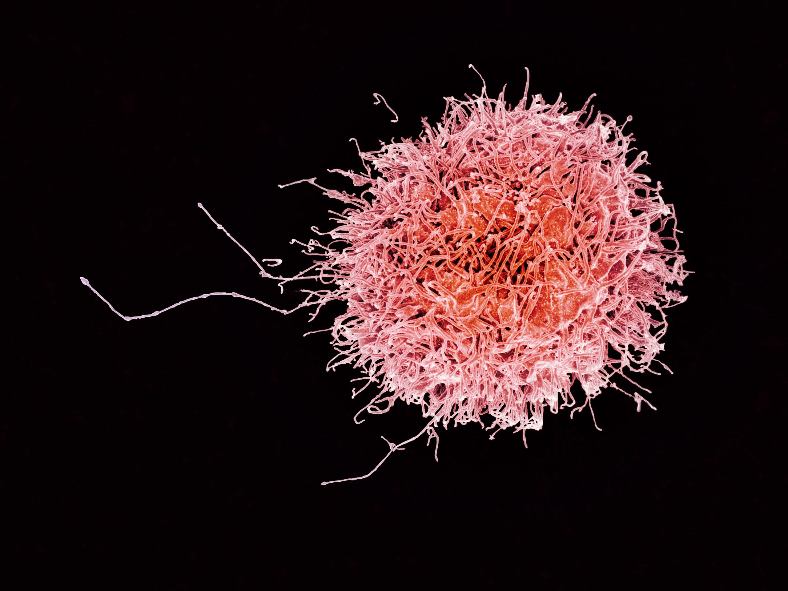

# Monocyt
Een monocyt is een van de verschillende soorten (**fagocytische**) witte bloedcellen en wordt geproduceerd in het beenmerg. Monocyten verplaatsen zich door het bloed naar verschillende weefsels in het lichaam, waar ze vervolgens veranderen in een `macrofaag` of een `dendritische cel` (NCI Dictionary Of Cancer Terms, z.d.).

Er wordt gedacht dat **geactiveerde monocyten** de eerste immuuncellen zijn die in de hersenen aankomen en daar (verdere) ontsteking veroorzaken (Khater et al., 2023). Met geactiveerd wordt bedoeld dat de monocyt, als gevolg van ontsteking, is veranderd in een macrofaag (Gjelstrup et al., 2017). Daarnaast stimuleren verworven immuuncellen zoals monocyten en macrofagen de migratie van T-cellen door de bloed-hersen barrière wat leidt tot beschadiging van de barrière (Tafti et al., 2024).

___________________________________________________________________
# Microglia

Microglia zijn de immuuncellen van het centrale zenuwstelsel (CZS), die een belangrijke rol spelen in het beschermen van de hersenen tegen schade door ziekteverwekkers en beschadigde cellen. Ze zijn zeer gevoelig voor veranderingen in hun omgeving en kunnen cytokinen produceren die ontstekingsreacties starten. Dit kan problematisch zijn wanneer er een overmatige of chronische ontsteking is, zoals in multiple sclerose (MS).

Microglia spelen een belangrijke rol in de ontwikkeling van MS door ontstekingen te veroorzaken die de zenuwcellen aanvallen en beschadigen. Wanneer microglia overactief worden, kunnen ze bijdragen aan de degeneratie van myeline en zenuwschade.

In MS kunnen microglia bijdragen aan de ziekte door:
- Het aansteken van ontstekingsreacties die de zenuwen beschadigen.
- Het bevorderen van de progressie van de ziekte door voortdurende ontsteking in het CZS.

___________________________________________________________________

# Natural Killer (NK-) cellen 

NK-cellen zijn een lymfocyt type en hebben een belangrijke functie in het immuunsysteem. In tegenstelling tot B- en T-cellen hebben NK-cellen geen activatie nodig van andere cellen om afwijkende cellen te doden. Ze richten zich op cellen die liganden (specifieke eiwitten) op hun oppervlak tot expressie brengen. Deze liganden zijn bij gezonde cellen namelijk afwezig of in een lage concentratie. En bij afwijkende cellen in hogere concentraties (MS Research, 2023). 

Bij mensen met progressieve MS zijn de NK-cellen, met vooral het CD56 molecuul, op het oppervlak aanwezig in de hersenen. Afgezien van de rol in het immuunsysteem houden de NK-cellen ook mogelijk zenuwschade en hersenontsteking tegen (MS Research, 2023). 

Een natural killer cel (Wikipedia, 2016)
___________________________________________________________________

# Antigeen presenterende cellen (APC's)

Een macrofaag die eerst een ziekteverwekker fagocyteert (op eet) en vervolgens een stukje van het antigeen op zijn celmembraan plakt. Het op het celmembraan geplakte antigeen wordt vervolgens aangeboden aan T-cellen en B-cellen. (Lijkt op FDC, maar is uitgebreider). 

___________________________________________________________________

# Macrofaag

Macrofagen spelen een belangrijke rol bij de verwijdering van myelineschede bij MS. Hierbij is aangetoond dat macrofagen MHC-class II antigenen produceren binnen de plaques (Brück et al., 1996).
___________________________________________________________________
# Astrocyt
Astrocyten spelen een dubbele rol bij de ontwikkeling van MS. Zo verergert het de aandoening onder andere door het recruiten van lymfocyten en het bijdragen aan weefselschade. Maar daarnaast spelen astrocyten ook een rol bij de beperking van schade door bijv. ontstekingen te remmen (Ponath et al., 2018).
___________________________________________________________________

# Bronnen
- Brb. (2024, 16 juli). Antigeen-presenterende cel (APC) - Biologielessen.nl. Blueprint Website. [https://biologielessen.nl/antigeen-presenterende-cel-apc/](https://biologielessen.nl/antigeen-presenterende-cel-apc/)
- Brück, W., Sommermeier, N., Bergmann, M., Zettl, U., Goebel, H. H., Kretzschmar, H. A., & Lassmann, H. (1996). Macrophages in multiple sclerosis. Immunobiology, 195(4–5), 588–600. [https://doi.org/10.1016/s0171-2985(96)80024-6](https://doi.org/10.1016/s0171-2985(96)80024-6)
- Gjelstrup, M. C., Stilund, M., Petersen, T., Møller, H. J., Petersen, E. L., & Christensen, T. (2017). Subsets of activated monocytes and markers of inflammation in incipient and progressed multiple sclerosis. Immunology And Cell Biology, 96(2), 160–174. [https://doi.org/10.1111/imcb.1025](https://doi.org/10.1111/imcb.1025)
- Khater, S. S., Mohamed, H. G., Saleh, R. M. M. A., Taha, S. I. A., & Kamal, N. E. E. M. (2023). Monocyte subsets in relapsing remitting multiple sclerosis Egyptian patients. Multiple Sclerosis And Related Disorders, 80, 105260. [https://doi.org/10.1016/j.msard.2023.105260](https://doi.org/10.1016/j.msard.2023.105260)
- MS Research. (2023, november 7). Natural killer cellen – vriend of vijand in MS? - MS Research. [https://msresearch.nl/ms-onderzoek/onderzoek/natural-killer-cellen-vriend-of-vijand-in-ms/](https://msresearch.nl/ms-onderzoek/onderzoek/natural-killer-cellen-vriend-of-vijand-in-ms/)
- NCI Dictionary of Cancer Terms. (z.d.). Cancer.gov. [https://www.cancer.gov/publications/dictionaries/cancer-terms/def/monocyte](https://www.cancer.gov/publications/dictionaries/cancer-terms/def/monocyte)
- Ponath, G., Park, C., & Pitt, D. (2018). The Role of Astrocytes in Multiple Sclerosis. Frontiers in Immunology, 9. [https://doi.org/10.3389/fimmu.2018.00217](https://doi.org/10.3389/fimmu.2018.00217)
- Tafti D, Ehsan M, Xixis KL. Multiple Sclerosis. [Updated 2024 Mar 20]. In: StatPearls [Internet]. Treasure Island (FL): StatPearls Publishing; 2024 Jan-. Available from: [https://www.ncbi.nlm.nih.gov/books/NBK499849/](https://www.ncbi.nlm.nih.gov/books/NBK499849/)
- Wikipedia. (2016, 30 juni). Human Natural Killer Cell. [https://commons.wikimedia.org/wiki/File:Human_Natural_Killer_Cell_(29228845335).jpg](https://commons.wikimedia.org/wiki/File:Human_Natural_Killer_Cell_(29228845335).jpg)