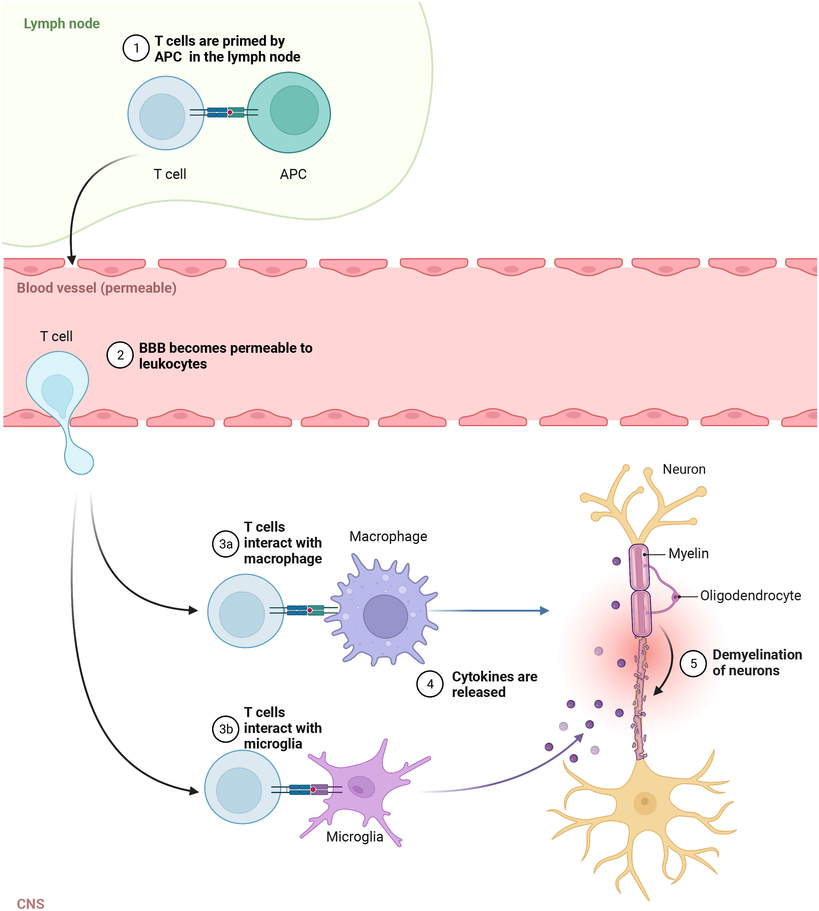

# T-lymfocyten

T-lymfocyten, of T-cellen, zijn ook cruciaal in het immuunsysteem, vooral wanneer B-cellen niet genoeg bescherming bieden. Ze helpen bij het vernietigen van geïnfecteerde cellen door het herkennen van antigenen op het oppervlak van deze cellen. 

Er zijn verschillende soorten T-cellen (National Multiple Sclerosis Society, z.d.):

- **Cytotoxische T-cellen**: Deze doden geïnfecteerde cellen.
- **T-helpercellen**: Ze activeren andere cellen zoals B-cellen en macrofagen om het immuunsysteem te versterken.
- **Regulerende T-cellen**: Deze onderdrukken overmatige immuunreacties om schade aan gezonde cellen te voorkomen.
- **Geheugen T-cellen**: Deze zorgen ervoor dat het lichaam sneller reageert wanneer het opnieuw in contact komt met een eerder tegengehouden ziekteverwekker.

## Link met multiple sclerose (MS)

In MS spelen T-cellen een rol in het veroorzaken van ontstekingen in het centrale zenuwstelsel (CZS). Ze dringen de hersenen en het ruggenmerg binnen, waar ze andere cellen activeren om de zenuwcellen aan te vallen, wat resulteert in demyelinisatie, ook wel de afbraak/beschadiging van myelineschede (National Multiple Sclerosis Society, z.d.).

Visualisatie van de rol die T-cellen spelen bij demyelinatie (Liu et al., 2022).

# Bronnen

- Liu, R., Du, S., Zhao, L., Jain, S., Sahay, K., Rizvanov, A., Lezhnyova, V., Khaibullin, T., Martynova, E., Khaiboullina, S., & Baranwal, M. (2022). Autoreactive lymphocytes in multiple sclerosis: Pathogenesis and treatment target. Frontiers in Immunology, 13. [https://doi.org/10.3389/fimmu.2022.996469](https://doi.org/10.3389/fimmu.2022.996469)
- National Multiple Sclerosis Society. (z.d.). Immune-Mediated Disease. [https://www.nationalmssociety.org/understanding-ms/what-is-ms/how-ms-affects-the-brain/immune-mediated-disease](https://www.nationalmssociety.org/understanding-ms/what-is-ms/how-ms-affects-the-brain/immune-mediated-disease)
