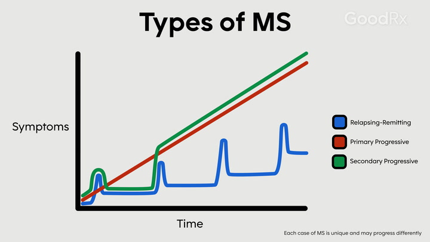

# Verschillende vormen & verloop MS 

**Multiple sclerose (MS)** is een chronische, progressieve auto-immuun aandoening met een onvoorspelbaar verloop. Het verloop wordt bepaald door meerdere factoren, waaronder de vorm van MS, het geslacht, de behandeling en de plaats in het centrale zenuwstelsel waar de ontstekingen ontstaan. Bij patiënten van MS zal soms sprake zijn van een snelle achteruitgang of juist van een mild verloop. Desondanks de (mogelijke) ernst van de aandoening, is MS niet dodelijk, maar vereist het vaak wel zorg en medicatie als gevolg van de neurologische achteruitgang. De levensduur van de meeste MS patiënten komt ongeveer overeen met gezonde mensen, maar soms kan het zijn dat een patient overlijdt aan de gevolgen van MS, maar dit is niet gebruikelijk (MS Research, 2021). 

## MS bij mannen/vrouwen  

Geslacht is een van de factoren die zowel het ontstaan als het verloop van de aandoening beïnvloeden. MS komt ongeveer twee keer zo vaak voor bij vrouwen als bij mannen. Mannen krijgen gemiddeld later een diagnose dan vrouwen, maar hebben ook een grotere kans op een ernstiger ziekteverloop (MS Research, 2024). 

## Verschillende vormen 

MS kan worden onderverdeeld in 3 vormen, met twee soorten fenotypen, namelijk ‘relapsing’ en ‘progressive’. 

**Relapsing**: 

- `Relapsing-remitting MS`

Relapses die worden opgevolgd door herstelperioden (remissies) waarin de neurologische functies deels of volledig herstellen. Dit is de meestvoorkomende vorm van MS en komt voor bij 85% van de MS gevallen (Hosny et al., 2023). 

**Progressive**: 

- `Secondary progressive MS` 

- `Primary progressive MS`

Er is sprake van een progressieve afname van de neurologische functies, en dus een verergering van de symptomen. Soms komen hierbij ook kleine verbeteringen of juist kleine relapsen voor, maar deze zijn inconsistent en resulteren niet in duidelijke verbeteringen. Secondary progressive MS ontstaat in 50% van de relapsing-remitting MS gevallen als secundaire aandoening. Primary progressive MS komt overeen met secondary progressive MS, maar ontstaat als primaire aandoening en komt voor in ongeveer 15% van de MS gevallen (Hosny et al., 2023). 

## Relapses

Relapses (ook wel ‘*schub*’, ‘*terugval*’ of ‘*exacerbatie*’) zijn perioden die voorkomen bij MS, waarbij reeds bestaande symptomen verergeren of nieuwe symptomen ontstaan. Relapses verschillen erg in ernst en kunnen de ene keer mild verlopen en de andere keer ernstig. Voordat een periode van verergering tot een relapse gerekend kan worden, zijn er 2 vereisten (Hosny et al., 2023): 

- De verergering moet minimaal 24 uur duren 
- Er moet minimaal een periode van 30 dagen tussen de huidige en vorige relapse zitten 

Ook moet er tijdens de relapse geen sprake zijn van een externe factor die bestaande symptomen zou kunnen verergeren, zoals koorts of een infectie (buiten het CZS). Als er wel sprake is van (een van) deze externe factoren en de bestaande symptomen hierdoor verergeren, wordt er gesproken van een ‘pseudoschub’. De klachten hierbij zijn tijdelijk en verdwijnen vaak binnen een paar uur tot een paar dagen (MS Research, 2021). 

## Clinically isolated syndrome (CIS) 

**Clinically isolated syndrome** (CIS) wordt vaak benoemd als vierde subtype van MS, echter verschilt deze met de andere drie typen, omdat er bij CIS nog géén MS-diagnose gesteld kan worden. Bij CIS komt er één keer een aanval voor. De klachten die hierbij voorkomen komen overeen met MS symptomen en bij 30-70% van de mensen met CIS ontwikkelt het zich uiteindelijk tot MS, vaak is dit relapsing-remitting MS (Nationaal MS Fonds, 2021).  

# Bronnen
Hosny, H. S., Shehata, H. S., Ahmed, S., Ramadan, I., Abdo, S. S., & Fouad, A. M. (2023). Predictors of severity and outcome of multiple sclerosis relapses. _BMC neurology_, _23_(1), 67. https://doi.org/10.1186/s12883-023-03109-6  

MS Research. (2021, 6 mei). Wat is het ziekte verloop van MS? - Stichting MS Research. https://msresearch.nl/over-ms-ziekte/ms-ziekte-verloop/ 

MS Research. (2024, 6 februari). Wie krijgen multiple sclerose (MS)? - Stichting MS Research. https://msresearch.nl/over-ms-ziekte/patient/ 

Nationaal MS Fonds. (2021, 5 oktober). Vormen van MS - Nationaal MS Fonds. https://nationaalmsfonds.nl/wat-is-ms/vormen-van-ms/#:~:text=Naast%20de%20verschillende%20klachten%20die,vorm%20kent%20een%20eigen%20ziektebeeld.  